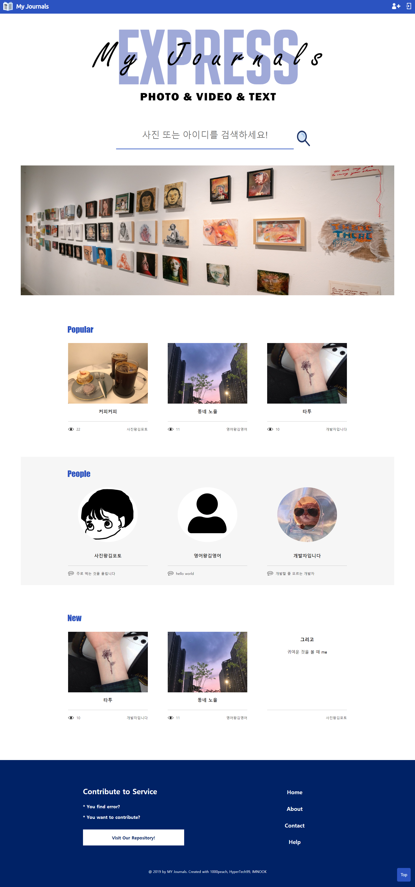

# My Journal Express

신문 스크랩처럼 자유로운 형식으로 사진(동영상), 글을 공유할 수 있는 **웹 SNS 서비스** 입니다.

세종대학교 학술동아리 Open Year Round에서 1학기 동안 웹 기초를 공부한 후 완성한 프로젝트 입니다.



## Development Environment

* OS : Windows 10
* Language : HTML, CSS, Javascript, jQuery
* Server : AWS-EC2, Node.js, MySQL, Putty
* Tool : Visual Studio Code, Git Bash (v2.22.0.windows.1)

## Step By Step Execution

위의 개발 환경을 기반으로 해당 프로젝트를 실행하는 방법입니다.

1. AWS EC2 서비스를 이용해 웹 서버를 생성한 후, private 인스턴스 키를 발급받습니다.

2. 인스턴스 키와 Putty를 연결하고, Putty를 이용하여 서버에 필수 패키지와 Express 관련 패키지를 설치합니다. 

```
sudo apt-get update
sudo apt-get install nodejs
sudo apt-get install npm
  
sudo apt install node-express-generator
npm install ejs
npm install express
```

3. 설치 후 원하는 위치에 웹 애플리케이션을 생성한 후 npm를 설치하여 Express 기본 구성 파일을 설정합니다.

```
express –e my-journal [원하는 이름]
cd my-journal
npm install
```

4. 생성한 애플리케이션에 프로젝트에 필요한 모듈을 설치하고, 서버에 업로드 할 사진을 저장하는 uploads 폴더를 생성합니다.

```
npm install --save body-parser
npm install --save express-session
npm install --save mysql
npm install --save fs-extra
npm install --save multer

mkdir uploads
```

5. 해당 저장소를 clone 합니다. vscode로 열어 sftp.json을 이용해 서버의 애플리케이션과 연결합니다.

6. server 폴더에 db.js를 생성하고, MySQL에 connection 하기 위해 다음 형식으로 본인의 정보로 입력한 후 저장합니다.

```
const mysql = require("mysql");

const connection = mysql.createConnection({
  host: "localhost",
  user: "유저 이름",
  password: "비밀번호",
  database: "project",
  charset: "utf8"
});

module.exports = connection;
```

7. 설치 후 애플리케이션을 ```npm start```를 통해 실행하고, AWS에서 발급받은 **인스턴스 아이피:포트번호**로 접속합니다.

## Websites

* [프로젝트 기획](https://1000-peach.tistory.com/2)

* [프로젝트 개발 및 상세 소개](https://1000-peach.tistory.com/3)

* [프로젝트 모바일 버전 저장소](https://github.com/HyperTech99/My-Journal-Express-Mobile)

## Contributors

* [1000peach](https://github.com/1000peach)<br>
gmail : sheissblack@gmail.com<br>
email : _970813@daum.net

* [HyperTech99](https://github.com/HyperTech99)<br>
gmail : smyun99@gmail.com<br>

* [IMNOOK](https://github.com/IMNOOK)<br>
gmail : leeminwok0405@gmail.com
